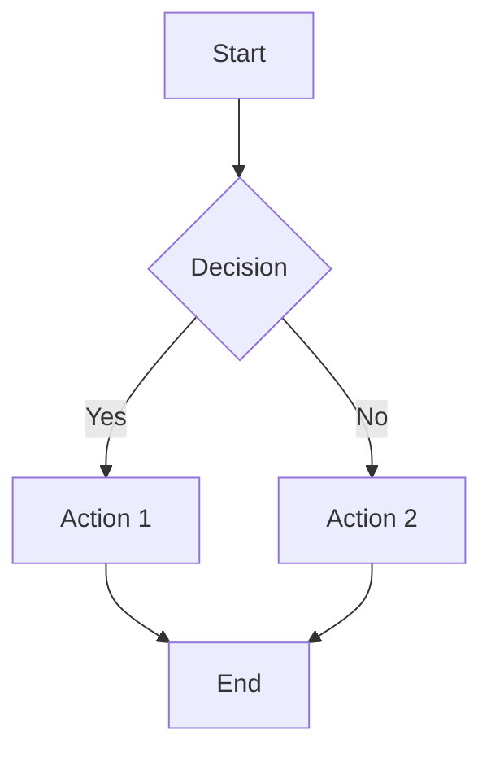
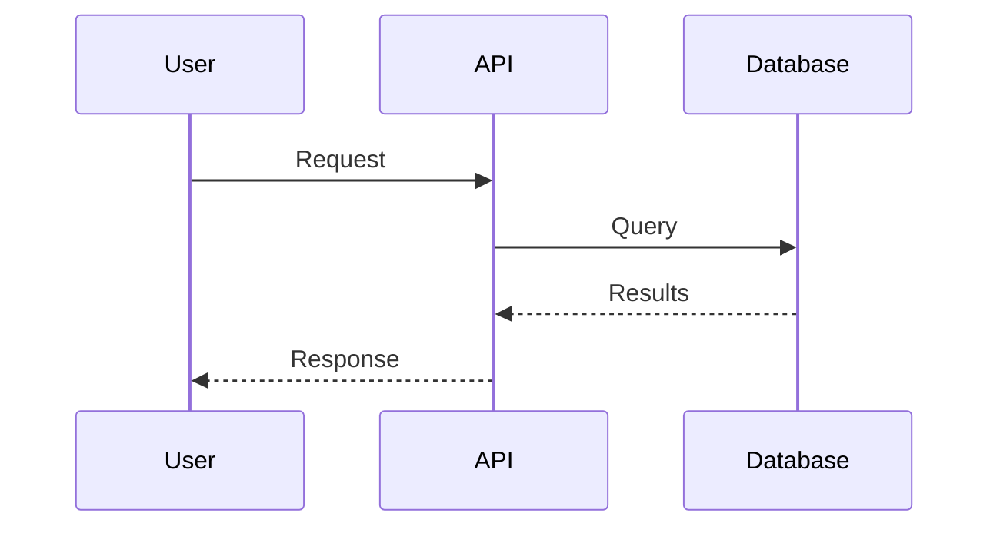
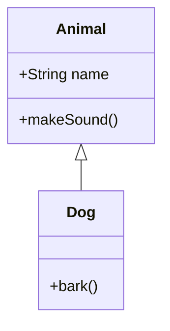
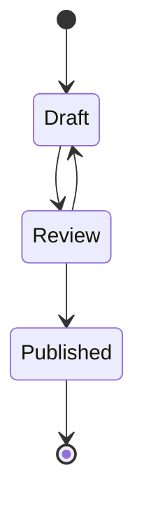

# Diagram Generation

Generate a Mermaid diagram based on: "$ARGUMENTS"

## Instructions

1. **Determine diagram type** from the request:
   - Process flow / workflow -> flowchart (graph TD/LR)
   - API calls / interactions -> sequence diagram
   - Object relationships -> class diagram
   - Lifecycle / states -> state diagram
   - Timeline / schedule -> Gantt chart
   - Concept relationships -> mindmap

2. **Write valid Mermaid code** and call `generate_image` with:
   - `intent`: "diagram" or "flowchart"
   - `params`: `{ "code": "<mermaid code>" }`

## Mermaid Syntax Quick Reference

### Flowchart

### Sequence Diagram

### Class Diagram

### State Diagram

## Node Shapes

| Syntax      | Shape              |
| ----------- | ------------------ |
| `A[Text]`   | Rectangle          |
| `B{Text}`   | Diamond (decision) |
| `C((Text))` | Circle             |
| `D([Text])` | Stadium            |
| `E[[Text]]` | Subroutine         |
| `F[(Text)]` | Database           |

## Edge Types

| Syntax      | Style            |
| ----------- | ---------------- |
| `-->`       | Arrow            |
| `---`       | Line             |
| `-.->`      | Dotted arrow     |
| `==>`       | Thick arrow      |
| `--text-->` | Arrow with label |

## Diagram Types

| Type      | Start Syntax            | Use Case          |
| --------- | ----------------------- | ----------------- |
| Flowchart | `graph TD` / `graph LR` | Process flows     |
| Sequence  | `sequenceDiagram`       | API interactions  |
| Class     | `classDiagram`          | OOP relationships |
| State     | `stateDiagram-v2`       | Lifecycles        |
| Gantt     | `gantt`                 | Project timelines |
| ER        | `erDiagram`             | Database schemas  |
| Mindmap   | `mindmap`               | Brainstorming     |
